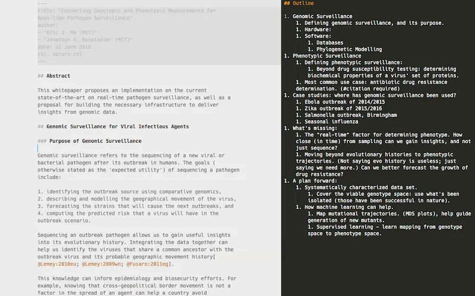
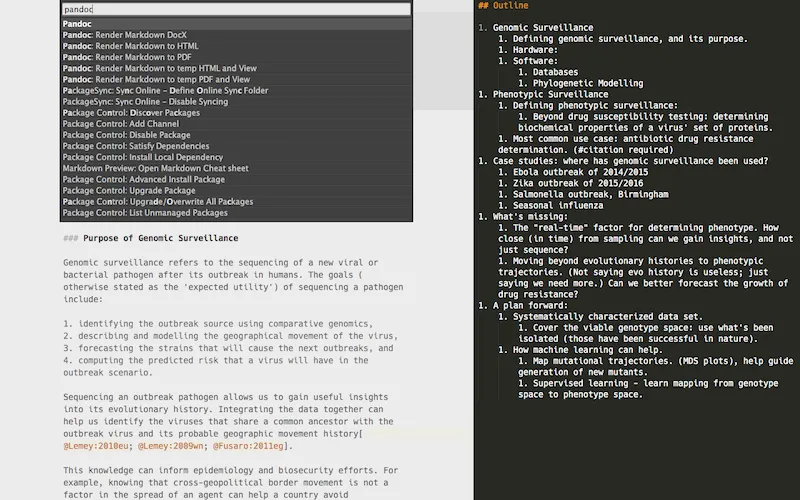
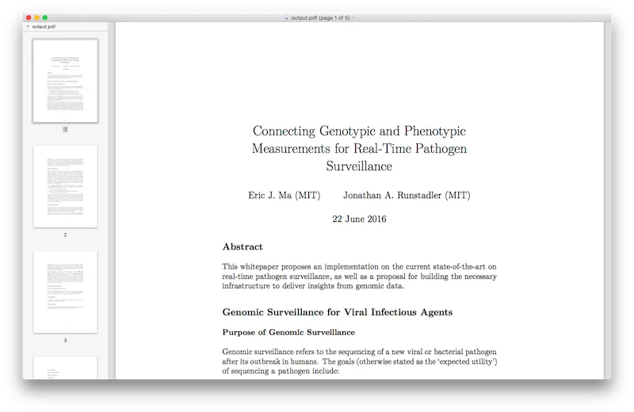
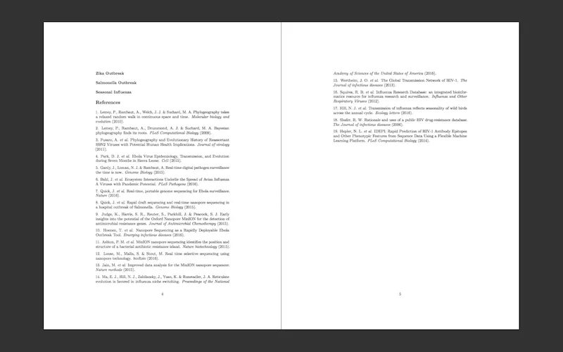

## Tooling up for Plain Text Academic Writing in Markdown

I finally got down to doing it! Here's my brief notes on how I set it up; it may change a bit later on, as my needs evolve, but it should be enough instructions for others to get setup.

### Motivation

I'm writing a [white paper on genomic surveillance](https://github.com/ericmjl/genomic-surveillance-whitepaper), so I thought I'd experiment with something new. By switching over to writing in plain text, I can ignore all distractions by other word processors. I'm looking at you, Word, Google Docs and others.

Because I get to write in plain text, I also get to version control the text. By selectively committing logical blocks, I can also easily selectively revert unwanted commits; it's rare, but once in a while it's saved my work.

Because it's plain text, I can export to anywhere with a bit of configuration.

Because it's written publicly, it's [great](https://speakerdeck.com/jakevdp/in-defense-of-extreme-openness).

### Overview

What I do here is basically use Sublime Text 3 (ST3) as a word processor. BibTex libraries are used for keeping track of papers, but I like Papers for organizing more than BibDesk - automatic downloading of PDFs is the best part. My compromise, then, is to export my Papers library to a master BibTex library prior to compiling everything into a single PDF. Papers can also add in Pandoc-style citations, which Pandoc can then parse to make an automatic bibliography. Everything is kept under version control, for reasons stated above.

It basically took me one morning's worth of time invested in tooling this up, but I can already imagine the amount of time saved by minimizing the time spent on formatting references, figure numbers, versioning, and (most of all) being able to write without being distracted.

### Tools

1. Papers for Mac (paid)
1. Pandoc (free)
1. Sublime Text (free/paid) - you can use it for free, but I decided to fess up and pay for it, the text editor is that good, that powerful, that I would encourage you to do the same too.
1. Git and GitHub (free)

### Setup

#### Central Bibliography

1. Set up a version controlled GitHub repository for the master bibliography file.
1. In Papers, export the library to that repository's directory. Take note of the `/path/to/master/library.bib`.

#### General Tooling

1. Install Pandoc, either using `homebrew`, or download a fresh copy of the installer binary. Note the `/path/to/pandoc`.
1. Install the LaTeX distribution, make sure that `pdflatex` is bundled. Note the `/path/to/pdflatex`.
1. Fork the [Citation Styles repository](https://github.com/citation-style-language/styles), and clone it to disk.
1. Install the `pandoc-fignos` plugin, to enable automatic figure numbering. Again, take note of the `/path/to/pandoc-fignos`.

#### Sublime Text Tooling

**Install:**

1. [Package Control](https://packagecontrol.io/installation)
1. [Pandoc](https://packagecontrol.io/packages/Pandoc)
1. [CiteBibTex](https://packagecontrol.io/packages/CiteBibtex)
1. [AcademicMarkdown](https://packagecontrol.io/packages/AcademicMarkdown)
1. [Git](https://packagecontrol.io/packages/Git)
1. [GitGutter](https://packagecontrol.io/packages/GitGutter)
1. [PackageSync](https://packagecontrol.io/packages/PackageSync)
1. [BracketHighlighter](https://packagecontrol.io/packages/BracketHighlighter)
1. [WordCount](https://packagecontrol.io/packages/WordCount)

**Configure:**

*Pandoc*

```json
    "pandoc-path": "/path/to/pandoc",
```
```json
      "PDF": {
        "scope": {
          "text.html": "html",
          "text.html.markdown": "markdown"
        },
        "pandoc-arguments": [
          "-t", "pdf",
          "--latex-engine=/path/to/pdflatex",
          "-o", "/path/to/output.pdf",
          "--filter", "/path/to/pandoc-fignos",
          "--filter=/path/to/pandoc-citeproc",
          "--bibliography=/path/to/master/library.bib",
        ]
      }
```

Apart from placing these `pandoc-arguments` under the `PDF` section, you may want to do the same for the `HTML` and `Word` sections.

*CiteBibTex*

Find the corresponding configuration fields, and change them to the following (making appropriate changes):

```json
    "bibtex_file": "/path/to/master/library.bib",
```
```json
    "autodetect_citation_style": true,
```

### User Interface

Today I learned that ST3 has a "Distraction Free Writing Mode", under the `View` menu. Earlier on, I also learned that it has a pane view mode, also under `View -->Layout`. Both have associated shortcut keys. My writing interface ended up looking something like what's in Figure {@fig:two-pane}.

{#fig:two-pane}

My outline is on the right, and the main text is on the left, and there's no distracting tabs, sliding preview, or directory structure (as is what I'm used to for coding).

### Writing

Get started by adding the YAML headers in the document (Figure {@fig:yaml-header}).

{#fig:yaml-header}

Specifically, the format of what I have above is:

```markdown
---
title: "My Title Here"
author:
- "Author 1 (Affiliation)"
- "Author 2 (Affiliation)"
date: 22 June 2016
csl: nature.csl
---
```

More details on what metadata can be stored in the headers can be found on the [Pandoc README](http://pandoc.org/README.html).


### Citations

Citations are done in Markdown by inserting:

```markdown
   [@citekey]
```

where the `citekey` is automatically generated by Papers, usually in the form of `LastName:YYYY[2- or 3-letter hash]`. An example of what gets inserted is `[@Young:2013px]`. I was reading through Papers' [documentation on the generation of a "universal" citekey](http://support.mekentosj.com/kb/cite-write-your-manuscripts-and-essays-with-citations/universal-citekey), and I quite like the idea. I think the specification is worth a read, and is an idea worth spreading (sorry, I like TED talks).

I intentionally configured my ST3 Pandoc package settings to use a global master library, rather than a project-specific one. I think it stemmed more from laziness than anything else; one less thing to manage is a better thing.

### Generating Outputs

Note that the way I had configured Pandoc (above) for PDF outputs was to use the master `.bib` library for matching up references. An additional thing I did was to keep a copy of the citation style language (CSL) markup file in the same directory as the Markdown document.

Within ST3, we can use the Command Palette to quickly generate the PDF output desired. Steps are:

1. Select Pandoc (Figure {@fig:cmd-pandoc})
1. Select PDF as the output (Figure {@fig:cmd-pdf})
1. Inspect that gorgeous PDF! (Figure {@fig:view-output})
1. Check your references! (Figure {@fig:view-references})

{#fig:cmd-pandoc}

{#fig:cmd-pdf}

{#fig:view-output}

{#fig:view-references}

Just to show how the figures get numbered correctly (I don't have any in the draft whitepaper I'm writing), you can inspect the [source code for this blog post](blog-source.md), and the associated [pdf file](blog-post.pdf). Note how I've not numbered anything except the associated files. It's pretty cool.

Alrighty - and that's it! Hope it helps others too.
